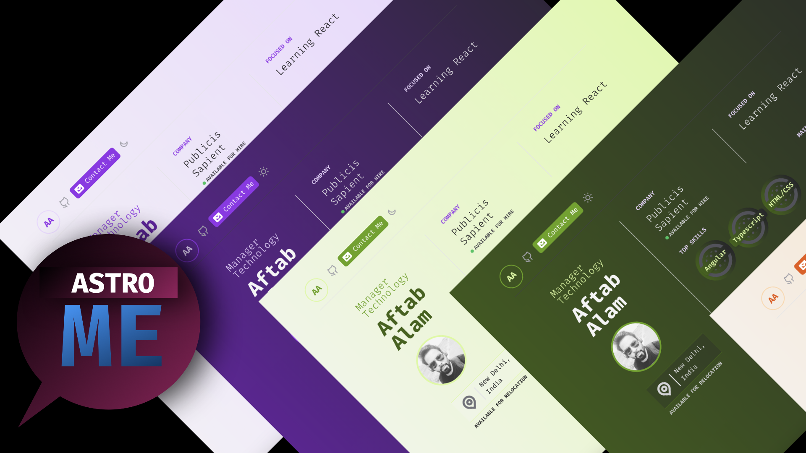

# Astro - Me
Crisp, minimal, personal portfolio theme for Astro

Astro Me is a minimal theme created to serve minimalistic personal portfolio needs. It ships with almost all the basic Astro components that you might need while creating light-weight, performant, personal portfolios, that focus on shipping less Javascript by default.

It's hugely inspired by [Gatsby Intro](https://github.com/wkocjan/gatsby-theme-intro) and strives to remain light, while providing the basis for a beautiful, minimal portfolio. It even supports features like "Dark Mode" and "Resume Download" on top.

## Features
- __Minimal, Crisp, Markdown Ready__
- __Responsive Design__
- __Data configuration through YAML files__ -
- __Svelte Ready__ - In its effort to remain light-weight, performant, and more approachable from Astro's POV, Svelte is used for interactive components like the theme switcher
- __Modular__ - The structure is highly modular, with components doing just one job, and one job well.
- __Color Themes__ - It supports 6+ color themes that could be configured using `tailwind.config.js`. Remember to restart when developing.
- __Dark Mode__ - All the color themes, support the Dark mode
- __Print Ready__ - You can print your one-page portfolio through the browser's print function. The CSS will adjust as per the print media.
- __Download Resume__ - You can even download the resume by visiting `/site-url/api/resume`

_More features coming soon_

- [ ] Form Spree for contact
- [ ] Improved styles

## Development Instructions
Unlike the default Astro project settings, this theme uses `yarn start` instead of `yarn dev` for local development to be compatible with `vercel dev` for local function development.
